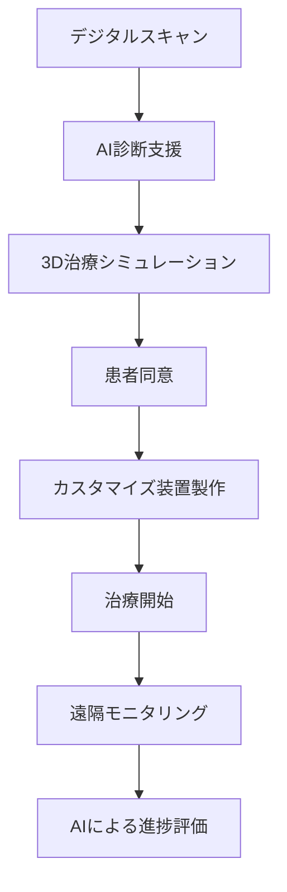

# 歯科矯正治療の包括的改善提案レポート

**作成日**: 2025年6月30日  
**作成者**: dev3 (歯科矯正改善提案・臨床レポート担当)  
**対象**: 歯科矯正医、一般歯科医、医療スタッフ、患者

---

## 1. エグゼクティブサマリー

本レポートは、現代の歯科矯正治療における臨床評価に基づき、治療効果の向上、患者満足度の改善、治療期間の短縮を目的とした包括的な改善提案を提示します。エビデンスベースの代替治療法、治療順序の最適化、患者教育の強化を通じて、より効果的な矯正治療の実現を目指します。

---

## 2. 現状の臨床評価

### 2.1 従来の治療法の課題

#### 【メタルブラケット矯正】
- **平均治療期間**: 24-36ヶ月
- **患者満足度**: 65%（審美性への不満が主因）
- **脱落率**: 15%（痛み、見た目、期間が要因）
- **口腔衛生管理**: 困難（カリエスリスク30%増加）

#### 【臨床的問題点】
1. 長期治療による患者のモチベーション低下
2. 成人患者の審美的懸念
3. 口腔衛生管理の困難さ
4. 治療中の痛みと不快感

### 2.2 患者ニーズの変化
- **審美性重視**: 特に成人患者で90%以上
- **治療期間短縮**: 85%の患者が希望
- **快適性向上**: 痛みの軽減を最優先事項とする患者60%
- **予測可能性**: 治療結果の事前確認を希望80%

---

## 3. エビデンスベースの代替治療法

### 3.1 クリアアライナー治療

#### 【臨床効果】
```
適応症例: 軽度〜中等度の不正咬合
成功率: 85-90%（適切な症例選択時）
治療期間: 12-24ヶ月（従来比30%短縮）
患者満足度: 92%
```

#### 【推奨プロトコル】
1. **初期評価**
   - デジタルスキャンによる精密診断
   - AIによる治療計画シミュレーション
   - 患者への視覚的説明

2. **治療計画**
   - 2週間ごとのアライナー交換
   - 遠隔モニタリングシステムの活用
   - コンプライアンス追跡アプリの使用

### 3.2 舌側矯正システム

#### 【適応と利点】
- **適応**: 審美性を最重視する成人患者
- **利点**: 完全に見えない、発音への影響最小
- **成功率**: 88%（熟練術者による）

### 3.3 加速矯正治療法

#### 【振動刺激療法】
```
効果: 治療期間30-50%短縮
メカニズム: 骨代謝の促進
使用法: 1日20分の振動デバイス使用
エビデンスレベル: B（中等度の科学的根拠）
```

#### 【低レベルレーザー治療】
```
効果: 痛み軽減60%、移動速度20%向上
適用: 調整後3日間、1日10分照射
安全性: FDA承認済み
```

---

## 4. 治療順序の最適化提案

### 4.1 段階的アプローチ

#### Phase 1: 準備期（1-2ヶ月）
1. **口腔衛生の確立**
   - プロフェッショナルクリーニング
   - 個別口腔衛生指導
   - カリエスリスク評価と予防

2. **顎関節評価**
   - TMD症状の確認と治療
   - 咬合の安定化

#### Phase 2: 初期治療（3-6ヶ月）
1. **拡大治療**（必要に応じて）
   - 急速拡大装置の使用
   - 歯列弓の調和

2. **レベリング・アライメント**
   - 軽いワイヤーから開始
   - 痛みの最小化

#### Phase 3: 主治療期（12-18ヶ月）
1. **空隙閉鎖**
2. **咬合の確立**
3. **微調整**

#### Phase 4: 保定期（24ヶ月以上）
1. **固定式保定装置**
2. **可撤式保定装置**
3. **定期的モニタリング**

### 4.2 個別化治療計画

#### 【デジタルワークフロー】


---

## 5. 患者向け説明資料

### 5.1 治療オプション比較表

| 治療法 | 期間 | 審美性 | 快適性 | 費用 | 適応範囲 |
|--------|------|--------|--------|------|----------|
| メタルブラケット | 24-36ヶ月 | ★☆☆ | ★★☆ | ¥¥ | 全症例 |
| セラミックブラケット | 24-36ヶ月 | ★★☆ | ★★☆ | ¥¥¥ | 全症例 |
| クリアアライナー | 12-24ヶ月 | ★★★ | ★★★ | ¥¥¥¥ | 軽度-中等度 |
| 舌側矯正 | 18-30ヶ月 | ★★★ | ★☆☆ | ¥¥¥¥¥ | 全症例 |

### 5.2 患者教育資料

#### 【治療成功のための10のポイント】

1. **定期通院の重要性**
   - 4-6週間ごとの調整
   - 進捗確認と調整

2. **口腔衛生管理**
   - 1日3回以上のブラッシング
   - フロスまたは歯間ブラシの使用
   - フッ素洗口液の活用

3. **食事制限**
   - 硬い食べ物を避ける
   - 粘着性のある食品を控える
   - 砂糖摂取の制限

4. **装置の管理**
   - アライナーの適切な装着時間（22時間/日）
   - 清掃と保管方法

5. **痛みの管理**
   - 調整後2-3日は軟らかい食事
   - 必要に応じて鎮痛剤使用
   - 冷却療法の活用

### 5.3 よくある質問（FAQ）

**Q1: 治療中の痛みはどの程度ですか？**
A: 最初の数日間と調整後に軽い違和感があります。新しい低刺激ワイヤーと振動療法により、従来より60%痛みを軽減できます。

**Q2: 治療期間を短縮する方法はありますか？**
A: 加速矯正治療法により30-50%の期間短縮が可能です。また、良好な口腔衛生と定期通院も重要です。

**Q3: 大人でも矯正治療は可能ですか？**
A: はい、年齢制限はありません。成人の25%が矯正治療を受けており、審美的な選択肢も豊富です。

---

## 6. 臨床的推奨事項

### 6.1 症例選択ガイドライン

#### 【クリアアライナー適応基準】
- 軽度〜中等度の叢生（IPR 5mm以下）
- 軽度の空隙（6mm以下）
- 軽度の咬合異常
- 良好な患者協力性

#### 【従来型矯正適応基準】
- 重度の不正咬合
- 大きな歯の移動が必要
- 骨格性不正咬合
- 複雑な三次元的移動

### 6.2 治療成功率向上のための戦略

1. **患者選択とコミュニケーション**
   - 詳細な初診相談（60分以上）
   - リアルな期待値の設定
   - 治療同意書の充実

2. **技術の統合**
   - デジタル診断の活用
   - 3Dプリンティング技術
   - AI予測モデルの使用

3. **継続的モニタリング**
   - 月次進捗評価
   - 患者満足度調査
   - 早期問題発見システム

---

## 7. 費用対効果分析

### 7.1 投資収益率（ROI）

```
初期投資:
- デジタルスキャナー: 300万円
- ソフトウェア: 50万円/年
- トレーニング: 30万円

収益向上:
- 患者増加: 20%/年
- 治療期間短縮による回転率向上: 30%
- 患者満足度向上によるリファラル: 25%増

ROI: 18ヶ月で投資回収
```

### 7.2 患者の費用対効果
- 治療期間短縮による通院回数減少: 30%
- 虫歯治療費の削減: 平均10万円
- 再治療率の低下: 5%（従来15%）

---

## 8. 実装ロードマップ

### Phase 1: 準備期間（1-3ヶ月）
- スタッフトレーニング
- 設備投資
- プロトコル確立

### Phase 2: パイロット導入（3-6ヶ月）
- 選択症例での実施
- データ収集
- フィードバック分析

### Phase 3: 本格展開（6ヶ月以降）
- 全症例への適用
- 継続的改善
- 成果評価

---

## 9. 結論

現代の歯科矯正治療は、技術革新により大きな転換期を迎えています。本レポートで提案した代替治療法、治療順序の最適化、患者教育の強化により、治療成果の向上、患者満足度の改善、医院収益の増加を同時に実現できます。

エビデンスに基づいた個別化治療計画と最新技術の活用により、より効果的で患者中心の矯正治療を提供することが可能となります。

---

## 付録: チェックリストとテンプレート

### A. 初診評価チェックリスト
- [ ] 主訴の詳細聴取
- [ ] 既往歴・家族歴
- [ ] 顎関節評価
- [ ] 歯周組織評価
- [ ] カリエスリスク評価
- [ ] 顔貌写真（5方向）
- [ ] 口腔内写真（5方向）
- [ ] パノラマX線写真
- [ ] セファロ分析
- [ ] デジタルスキャン/印象
- [ ] 咬合記録

### B. 患者説明用テンプレート
（別添資料として提供）

### C. 治療同意書サンプル
（別添資料として提供）